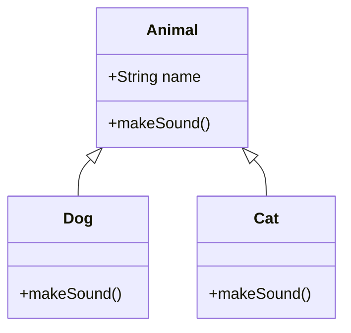

# Object-Oriented Design (OOD)

Object-Oriented Design is the process of planning a system of interacting objects for the purpose of solving a software problem. It is one approach to software design.

## Core Concepts

1. **Encapsulation**: Bundling data and methods that work on that data within one unit, e.g., a class in Java, C++, or Python.
2. **Abstraction**: Hiding complex implementation details and showing only the essential features of the object.
3. **Inheritance**: A mechanism wherein a new class is derived from an existing class.
4. **Polymorphism**: The ability of different classes to be treated as instances of the same class through a common interface.



## Example: Polymorphism in Action

```python
class Animal:
    def make_sound(self):
        raise NotImplementedError

class Dog(Animal):
    def make_sound(self):
        return "Woof!"

class Cat(Animal):
    def make_sound(self):
        return "Meow!"

# Polymorphism: same interface, different behavior
animals = [Dog(), Cat(), Dog()]
for animal in animals:
    print(animal.make_sound())  # Woof! Meow! Woof!
```

---

## Quiz

import MCQ from '@/components/mcq/MCQ'

<MCQ 
  question="Which OOD concept refers to hiding the internal state and requiring all interaction to be performed through an object's methods?"
  options={[
    "Inheritance",
    "Encapsulation",
    "Polymorphism",
    "Abstraction"
  ]}
  correctAnswerIndex={1}
  explanation="Encapsulation is the bundling of data with the methods that operate on that data, or the restricting of direct access to some of an object's components."
/>

<MCQ
  question="A `Shape` base class has a method `area()`. `Circle` and `Rectangle` both extend `Shape` and override `area()`. If you call `shape.area()` on a variable typed as `Shape`, which OOD principle is being demonstrated?"
  options={[
    "Encapsulation",
    "Abstraction",
    "Polymorphism",
    "Composition"
  ]}
  correctAnswerIndex={2}
  explanation="Polymorphism allows objects of different types to be treated through a common interface. The correct area() implementation is called at runtime based on the actual object type."
/>

<MCQ
  question="You have a `Logger` class that writes to a file. Later you need it to also write to a database. Which OOD approach is preferred?"
  options={[
    "Modify the Logger class to add database code directly.",
    "Create a LogTarget interface and have FileLogger and DatabaseLogger implement it, then inject the target into Logger.",
    "Copy-paste the Logger class and change file writes to database writes.",
    "Use global variables to switch between file and database."
  ]}
  correctAnswerIndex={1}
  explanation="Using an interface (abstraction) and injecting dependencies follows the Open/Closed Principle and Dependency Inversion — the Logger is open for extension but closed for modification."
/>
