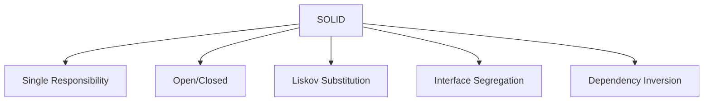

# SOLID Principles

SOLID is an acronym for five design principles intended to make software designs more understandable, flexible, and maintainable.

1. **S - Single Responsibility Principle (SRP)**: A class should have one, and only one, reason to change.
2. **O - Open/Closed Principle (OCP)**: Software entities should be open for extension, but closed for modification.
3. **L - Liskov Substitution Principle (LSP)**: Objects in a program should be replaceable with instances of their subtypes without altering the correctness of that program.
4. **I - Interface Segregation Principle (ISP)**: Many client-specific interfaces are better than one general-purpose interface.
5. **D - Dependency Inversion Principle (DIP)**: Depend upon abstractions, not concretions.



## Example: Dependency Inversion

```python
# BAD: High-level module depends on a concrete low-level module
class MySQLDatabase:
    def save(self, data): ...

class UserService:
    def __init__(self):
        self.db = MySQLDatabase()  # tightly coupled

# GOOD: Both depend on an abstraction
class Database:  # abstraction
    def save(self, data): ...

class MySQLDatabase(Database):
    def save(self, data): ...

class UserService:
    def __init__(self, db: Database):  # depends on abstraction
        self.db = db
```

---

## Quiz

import MCQ from '@/components/mcq/MCQ'

<MCQ 
  question="Which SOLID principle states that a class should have only one reason to change?"
  options={[
    "Open/Closed Principle",
    "Liskov Substitution Principle",
    "Single Responsibility Principle",
    "Dependency Inversion Principle"
  ]}
  correctAnswerIndex={2}
  explanation="The Single Responsibility Principle (SRP) states that every module, class, or function should have responsibility over a single part of the functionality provided by the software."
/>

<MCQ
  question="A `Rectangle` class has `setWidth()` and `setHeight()`. A `Square` subclass overrides both to keep width == height. A function tests `rect.setWidth(5); rect.setHeight(10); assert rect.area() == 50` and fails for Square. Which SOLID principle is violated?"
  options={[
    "Single Responsibility Principle",
    "Open/Closed Principle",
    "Liskov Substitution Principle",
    "Interface Segregation Principle"
  ]}
  correctAnswerIndex={2}
  explanation="LSP says subtypes must be substitutable for their base types. Square changes the behavior of setWidth/setHeight in a way that breaks the parent's contract, violating LSP."
/>

<MCQ
  question="You have a `Worker` interface with `work()` and `eat()` methods. A `Robot` class implements `Worker` but has no meaningful implementation for `eat()`. Which SOLID principle is being violated?"
  options={[
    "Single Responsibility Principle",
    "Open/Closed Principle",
    "Interface Segregation Principle",
    "Dependency Inversion Principle"
  ]}
  correctAnswerIndex={2}
  explanation="ISP states clients should not be forced to depend on interfaces they do not use. Robot should not implement eat(). Split into Workable and Eatable interfaces."
/>
