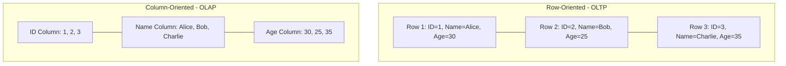

# Database Design: OLTP vs OLAP

When designing a system, choosing the right database paradigm is critical. The two primary paradigms are OLTP and OLAP.

## OLTP (Online Transaction Processing)

OLTP systems are designed for fast, reliable, and highly concurrent transactional processing. These are the databases that power your live applications.

- **Workload:** High volume of short, fast queries (Reads, Inserts, Updates, Deletes).
- **Data Model:** Highly normalized (3NF) to avoid data redundancy and ensure fast updates.
- **Storage:** Row-oriented. Data for a single row is stored contiguously on disk.
- **Examples:** MySQL, PostgreSQL, Oracle.
- **Use Case:** E-commerce checkout, user profile updates, banking transactions.

## OLAP (Online Analytical Processing)

OLAP systems are designed for complex data analysis, reporting, and business intelligence.

- **Workload:** Low volume of very complex, long-running queries (mostly Reads). Usually involves aggregations (SUM, AVG) over millions of rows.
- **Data Model:** Denormalized (Star Schema or Snowflake Schema) to optimize for read speed.
- **Storage:** Column-oriented. Data for a single column is stored contiguously on disk. This makes aggregations incredibly fast and allows for high compression.
- **Examples:** Amazon Redshift, Google Redshift, Snowflake, ClickHouse.
- **Use Case:** Generating monthly sales reports, user behavior analysis.

## Row-Oriented vs Column-Oriented Storage

import MCQ from '@/components/mcq/MCQ'

<MCQ 
  question="If you need to calculate the average age of 10 million users, which storage format is more efficient?"
  options={[
    "Row-oriented, because it keeps the user's name and age together.",
    "Column-oriented, because it can read just the 'Age' column from disk without loading the other data.",
    "Document-oriented, because JSON is faster to parse.",
    "Graph-oriented, because users are connected."
  ]}
  correctAnswerIndex={1}
  explanation="Column-oriented storage stores all values for a specific column together. To calculate an average age, the database only needs to read the 'Age' column blocks from disk, ignoring names, addresses, etc., resulting in massive I/O savings."
/>

<MCQ
  question="An e-commerce site processes thousands of real-time orders per second. Which database category is most appropriate for this transactional workload?"
  options={[
    "OLAP (Snowflake, Redshift)",
    "OLTP (PostgreSQL, MySQL)",
    "Data Lake (S3 + Spark)",
    "Graph Database (Neo4j)"
  ]}
  correctAnswerIndex={1}
  explanation="Real-time order processing requires low-latency, ACID-compliant transactions with frequent inserts and updates — the exact workload OLTP databases are designed for."
/>

<MCQ
  question="Why does column-oriented storage achieve much higher compression ratios than row-oriented storage?"
  options={[
    "Columns use a different file format.",
    "Values in a single column are of the same type and often have similar/repeated values, making them highly compressible with techniques like run-length encoding and dictionary encoding.",
    "Row-oriented databases do not support compression.",
    "Column-oriented databases use smaller data types."
  ]}
  correctAnswerIndex={1}
  explanation="A column of 'country' values might contain millions of entries but only 200 unique countries. Dictionary encoding replaces each country name with a small integer, achieving massive compression. Row stores mix types (strings, ints, dates) in each block, making compression far less effective."
/>
