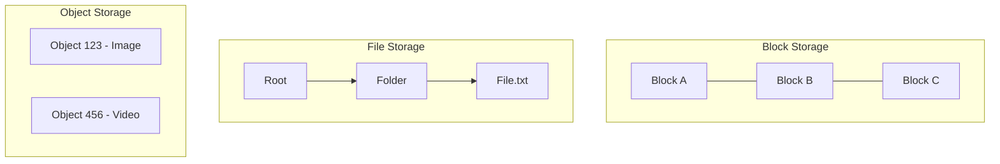

# Object vs Block vs File Storage

Understanding the differences between storage types is crucial for cloud architecture design.

## 1. Block Storage
Data is broken down into raw, fixed-size blocks. The operating system manages these blocks and formats them with a File System (like ext4 or NTFS).
- **How it works:** It acts like a raw physical hard drive attached to a server.
- **Access:** Accessed via low-level storage protocols (iSCSI, Fibre Channel).
- **Pros:** Extremely fast, low latency, highly customizable.
- **Cons:** Can only be attached to one server at a time (usually). Hard to scale infinitely.
- **Use Cases:** Databases (MySQL, PostgreSQL), OS boot drives.
- **AWS Equivalent:** Amazon EBS (Elastic Block Store).

## 2. File Storage
Data is stored as files within a hierarchical directory structure (folders and subfolders).
- **How it works:** It provides a shared network file system.
- **Access:** Accessed via file-level protocols (NFS, SMB).
- **Pros:** Easy to use, can be shared across multiple servers simultaneously.
- **Cons:** Performance degrades as the hierarchy grows very large.
- **Use Cases:** Shared corporate directories, centralized log storage, content management systems.
- **AWS Equivalent:** Amazon EFS (Elastic File System).

## 3. Object Storage
Data is stored as flat "objects" in a massive, flat address space. There is no folder hierarchy. Each object consists of:
1. The data itself.
2. A variable amount of metadata.
3. A globally unique identifier (URI).
- **How it works:** You retrieve data via HTTP REST APIs (GET, PUT, DELETE) using the unique URI.
- **Pros:** Infinitely scalable, very cheap, great for unstructured data.
- **Cons:** High latency compared to block storage. You cannot modify a small piece of an object; you must rewrite the entire object.
- **Use Cases:** Images, videos, backups, archives, static website hosting.
- **AWS Equivalent:** Amazon S3 (Simple Storage Service).

import MCQ from '@/components/mcq/MCQ'

<MCQ 
  question="If you are designing a system like YouTube and need to store petabytes of user-uploaded videos, which storage type is the most appropriate and cost-effective?"
  options={[
    "Block Storage (e.g., AWS EBS)",
    "File Storage (e.g., AWS EFS)",
    "Object Storage (e.g., AWS S3)",
    "Relational Database (e.g., MySQL)"
  ]}
  correctAnswerIndex={2}
  explanation="Object storage (like S3) is designed for massive, infinite scale of unstructured data like videos and images. It is significantly cheaper than block storage and doesn't suffer from the hierarchical performance degradation of file storage."
/>

<MCQ
  question="Why does a PostgreSQL database running on AWS typically use EBS (block storage) rather than S3 (object storage)?"
  options={[
    "S3 is more expensive than EBS.",
    "Databases need low-latency random read/write access to individual disk blocks. S3 only supports full-object read/write via HTTP, which is too slow and coarse-grained for database page-level I/O.",
    "EBS has better data encryption.",
    "PostgreSQL does not support cloud storage."
  ]}
  correctAnswerIndex={1}
  explanation="Block storage provides a raw block device with sub-millisecond latency for random reads/writes of 4-16KB pages — exactly what a database engine needs. Object storage is HTTP-based, has higher latency, and cannot modify part of an object."
/>

<MCQ
  question="S3 offers 11 nines (99.999999999%) durability. How does it achieve this?"
  options={[
    "By storing data on a single very reliable hard drive.",
    "By automatically replicating each object across multiple physically separated Availability Zones and continuously verifying data integrity.",
    "By compressing data to reduce corruption risk.",
    "By using RAID 6 on each server."
  ]}
  correctAnswerIndex={1}
  explanation="S3 stores multiple redundant copies of each object across at least 3 Availability Zones (geographically separate data centers). It also performs continuous integrity checks (checksums) and automatically re-replicates if any copy is lost."
/>
