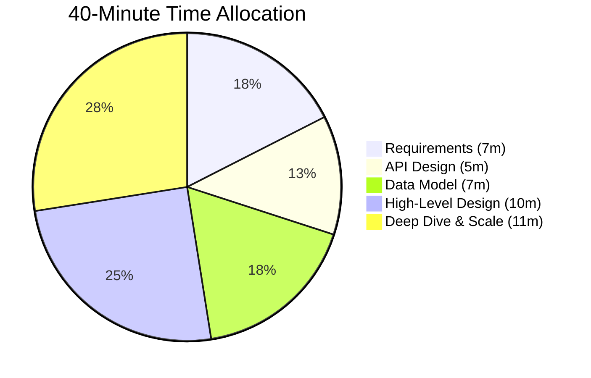

# The 40-Minute Attack Plan

A typical system design interview lasts 45-60 minutes, leaving you with about 40 minutes of actual design time. If you just start drawing boxes, you will fail. You need a structured framework.

## The Framework (RADOS)

### 1. Requirements & Clarification (5-7 mins)
- **Never assume anything.** The prompt is intentionally vague (e.g., "Design Twitter").
- Define the **Functional Requirements** (What does the system do? e.g., Post tweet, view timeline).
- Define the **Non-Functional Requirements** (Scale, Latency, Availability vs. Consistency).
- *See the "Clarifying Inputs" page for exactly what to ask.*

### 2. API Design (5 mins)
- Define the contract between the client and the server.
- E.g., `POST /v1/tweet (user_id, content, media_url)` -> Returns `tweet_id`.
- This proves you understand how the system will actually be used.

### 3. Data Model & Storage (5-7 mins)
- What data are we storing? (Users, Tweets, Follows).
- Choose the right database (SQL vs NoSQL, Document vs Graph) and justify your choice.
- Sketch out the schema.

### 4. High-Level Design (10 mins)
- Draw the core components: Client -> Load Balancer -> API Gateway -> Services -> Databases.
- Trace the path of a read request and a write request through your architecture.

### 5. Scale & Deep Dive (10-15 mins)
- This is where you pass or fail. Identify the bottlenecks in your high-level design.
- "The database will crash with 10k writes/sec." -> *Solution: Add a Message Queue or Shard the DB.*
- "Reads are too slow." -> *Solution: Add Redis Caching and a CDN.*
- Discuss Trade-offs (e.g., Eventual Consistency vs Strong Consistency).

import MCQ from '@/components/mcq/MCQ'

<MCQ 
  question="What is the most common mistake candidates make in the first 5 minutes of a system design interview?"
  options={[
    "Choosing the wrong database.",
    "Jumping straight into drawing architecture diagrams without clarifying the requirements and scale.",
    "Not knowing how to calculate network bandwidth.",
    "Forgetting to add a load balancer."
  ]}
  correctAnswerIndex={1}
  explanation="The prompt is always vague on purpose. If you start designing without clarifying the scope (e.g., designing a globally distributed system when the interviewer only wanted a local tool), you will fail. Always clarify requirements first."
/>
